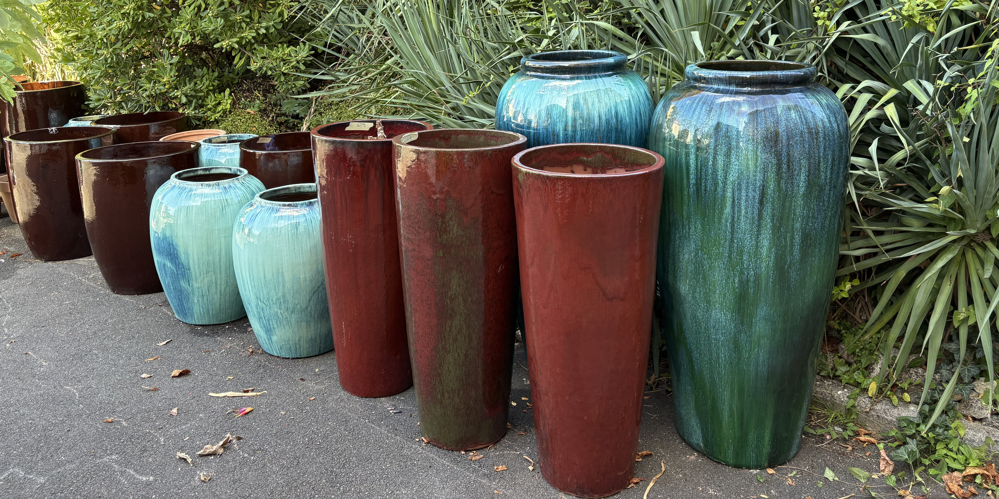
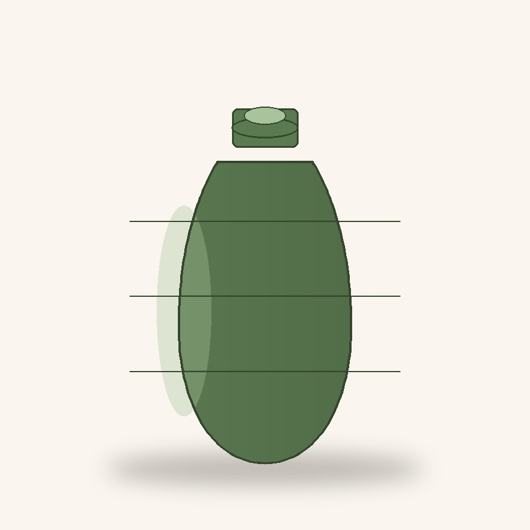
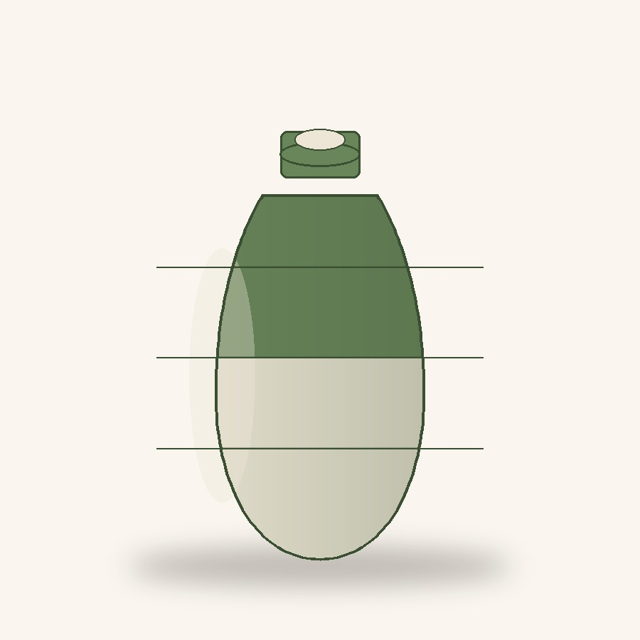
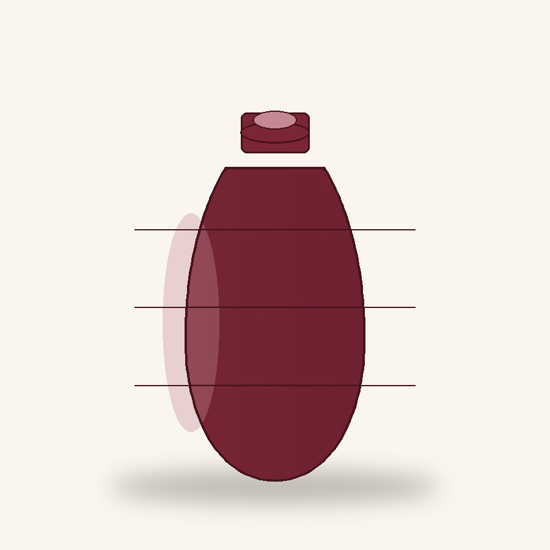
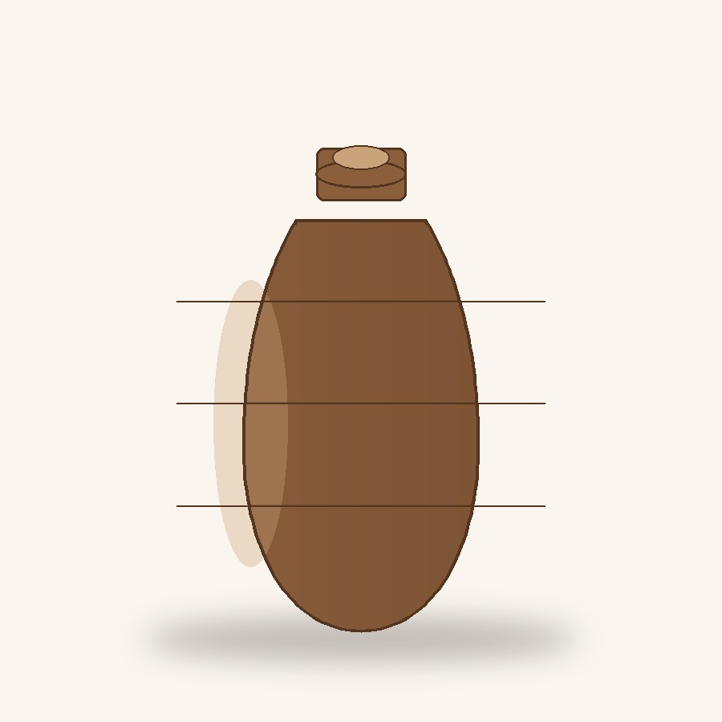
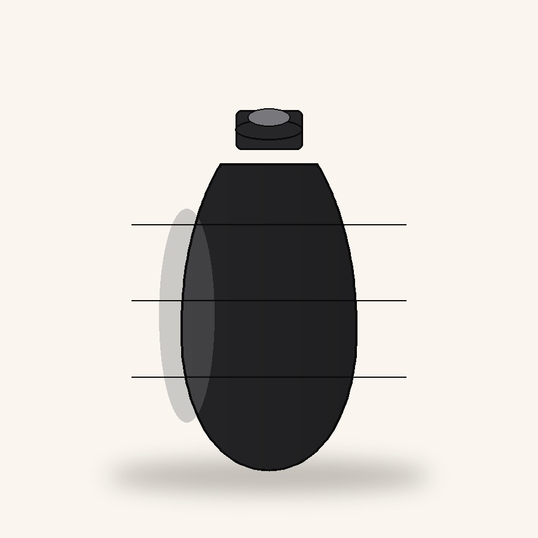
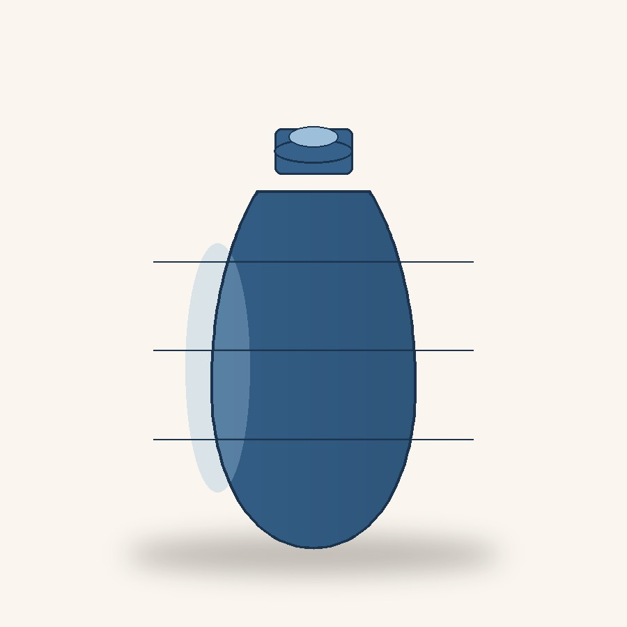

---
layout: null
title: "Pré-vente des Jarres CFOC — Croix-Rouge française, DT Yvelines"
description: "Prévente solidaire de jarres CFOC au profit des actions locales de la Croix-Rouge française — Délégation territoriale des Yvelines."
lang: fr
permalink: /operation-jarres/
<style>
:root {
  --red: #E2001A;
  --red-dark: #A8000F;
  --ink: #1E2224;
  --porcelain-blue: #2C5B70;
  --porcelain-blue-light: #DCE9EC;
  --cream: #FAF6EF;
  --paper: #FFFFFF;
  --line: #E4DDD0;
  --muted: #6B6459;
  --radius: 4px;
}

* { box-sizing: border-box; }
html { scroll-behavior: smooth; }
body {
  margin: 0;
  color: var(--ink);
  background: var(--cream);
  line-height: 1.55;
  font-family: "Public Sans", system-ui, -apple-system, BlinkMacSystemFont, "Segoe UI", sans-serif;
}
h1, h2, h3 {
  font-family: Georgia, "Times New Roman", serif;
  font-weight: 600;
  letter-spacing: -.01em;
}
a { color: inherit; }
img { max-width: 100%; display: block; }

.wrap {
  max-width: 1120px;
  margin: 0 auto;
  padding: 0 24px;
}

.site-header {
  position: sticky;
  top: 0;
  z-index: 50;
  background: var(--paper);
  border-bottom: 1px solid var(--line);
}
.site-nav {
  display: flex;
  align-items: center;
  justify-content: space-between;
  gap: 20px;
  padding: 14px 24px;
  max-width: 1120px;
  margin: 0 auto;
}
.brand {
  display: flex;
  align-items: center;
  gap: 10px;
  font-family: Georgia, "Times New Roman", serif;
  font-weight: 600;
  font-size: 1.05rem;
}
.cross {
  width: 26px;
  height: 26px;
  position: relative;
  flex: none;
}
.cross::before,
.cross::after {
  content: "";
  position: absolute;
  background: var(--red);
}
.cross::before { left: 40%; top: 0; width: 20%; height: 100%; }
.cross::after { top: 40%; left: 0; height: 20%; width: 100%; }
.brand small {
  display: block;
  font-family: inherit;
  font-weight: 500;
  color: var(--muted);
  font-size: .68rem;
  letter-spacing: .03em;
  text-transform: uppercase;
}
.site-links {
  display: flex;
  gap: 28px;
  font-size: .92rem;
  font-weight: 500;
}
.site-links a { text-decoration: none; opacity: .75; }
.site-links a:hover { opacity: 1; }
.selection {
  display: inline-flex;
  align-items: center;
  gap: 8px;
  background: var(--ink);
  color: #fff;
  border-radius: 999px;
  padding: 9px 18px;
  font-weight: 600;
  font-size: .85rem;
  text-decoration: none;
}
.selection span {
  background: var(--red);
  border-radius: 999px;
  padding: 1px 8px;
  font-size: .75rem;
}

.hero {
  background: linear-gradient(180deg, #fff 0%, var(--cream) 100%);
  border-bottom: 1px solid var(--line);
}
.hero-grid {
  display: grid;
  grid-template-columns: 1.1fr .9fr;
  gap: 56px;
  align-items: center;
  padding: 64px 24px 48px;
  max-width: 1120px;
  margin: 0 auto;
}
.eyebrow {
  display: inline-flex;
  align-items: center;
  gap: 8px;
  background: var(--porcelain-blue-light);
  color: var(--porcelain-blue);
  font-size: .75rem;
  font-weight: 700;
  letter-spacing: .06em;
  text-transform: uppercase;
  padding: 6px 12px;
  border-radius: 999px;
  margin-bottom: 18px;
}
.hero h1 {
  font-size: clamp(2.1rem, 4vw, 3.2rem);
  line-height: 1.06;
  margin: 0;
}
.hero h1 em { font-style: normal; color: var(--red); }
.lead {
  margin-top: 18px;
  font-size: 1.08rem;
  color: var(--muted);
  max-width: 46ch;
}
.hero-facts {
  display: flex;
  gap: 28px;
  margin-top: 32px;
  flex-wrap: wrap;
}
.fact strong {
  display: block;
  font-family: Georgia, "Times New Roman", serif;
  font-size: 1.3rem;
}
.fact span { font-size: .8rem; color: var(--muted); }
.hero-cta {
  margin-top: 34px;
  display: flex;
  gap: 14px;
  flex-wrap: wrap;
}
.btn {
  display: inline-flex;
  align-items: center;
  gap: 8px;
  padding: 13px 24px;
  border-radius: 999px;
  font-weight: 600;
  font-size: .92rem;
  text-decoration: none;
  border: 1.5px solid transparent;
}
.btn-primary { background: var(--red); color: #fff; }
.btn-primary:hover { background: var(--red-dark); }
.btn-ghost { border-color: var(--ink); color: var(--ink); }
.hero-image {
  width: 100%;
  max-width: 320px;
  margin: auto;
  border-radius: 8px;
}

.steps {
  padding: 56px 24px;
  background: var(--paper);
}
.steps h2, .catalog h2, .info h2, .order h2 {
  margin-top: 0;
}
.section-intro {
  text-align: center;
  color: var(--muted);
  margin-bottom: 38px;
}
.step-grid {
  display: grid;
  grid-template-columns: repeat(3, 1fr);
  gap: 28px;
  max-width: 1000px;
  margin: 0 auto;
}
.step {
  border-top: 2px solid var(--red);
  padding-top: 14px;
}
.step .number {
  font-family: Georgia, "Times New Roman", serif;
  color: var(--red);
  font-size: .85rem;
  font-weight: 600;
}
.step h3 { font-size: 1.05rem; margin: 6px 0; }
.step p { color: var(--muted); font-size: .92rem; margin-top: 6px; }

.catalog { padding: 64px 24px; }
.catalog-head {
  display: flex;
  justify-content: space-between;
  align-items: flex-end;
  flex-wrap: wrap;
  gap: 16px;
  margin-bottom: 28px;
}
.catalog-head p { color: var(--muted); margin: 6px 0 0; }
.product-grid {
  display: grid;
  grid-template-columns: repeat(auto-fill, minmax(220px, 1fr));
  gap: 22px;
}
.product-card {
  background: var(--paper);
  border: 1px solid var(--line);
  border-radius: var(--radius);
  overflow: hidden;
  display: flex;
  flex-direction: column;
}
.product-card img {
  width: 100%;
  aspect-ratio: 1 / 1;
  object-fit: cover;
  background: var(--porcelain-blue-light);
}
.product-body {
  padding: 16px;
  display: flex;
  flex-direction: column;
  gap: 6px;
  flex: 1;
}
.product-tag {
  font-size: .7rem;
  text-transform: uppercase;
  letter-spacing: .05em;
  color: var(--porcelain-blue);
  font-weight: 700;
}
.product-body h3 { font-size: 1.05rem; margin: 0; }
.product-meta { font-size: .82rem; color: var(--muted); }
.product-price {
  margin-top: auto;
  padding-top: 10px;
  font-family: Georgia, "Times New Roman", serif;
  font-size: 1.15rem;
}
.stock {
  font-size: .78rem;
  color: var(--muted);
}
.note {
  margin-top: 24px;
  color: var(--muted);
  font-size: .9rem;
}

.info {
  padding: 56px 24px;
  background: var(--porcelain-blue);
  color: #fff;
}
.info-grid {
  display: grid;
  grid-template-columns: 1fr 1fr;
  gap: 40px;
  max-width: 1000px;
  margin: 0 auto;
  align-items: start;
}
.info h2 { color: #fff; }
.info-list {
  list-style: none;
  padding: 0;
  margin: 18px 0 0;
  display: flex;
  flex-direction: column;
  gap: 14px;
}
.info-list li {
  display: flex;
  gap: 12px;
  font-size: .95rem;
}
.info-list b { display: block; }
.info-list .dot {
  width: 8px;
  height: 8px;
  border-radius: 50%;
  background: #fff;
  margin-top: 7px;
  flex: none;
}
.map {
  width: 100%;
  min-height: 280px;
  border: 0;
  border-radius: var(--radius);
}

.order {
  padding: 64px 24px;
  background: var(--paper);
}
.order-wrap { max-width: 760px; margin: 0 auto; }
.order-summary {
  margin-top: 32px;
  border: 1px solid var(--line);
  border-radius: var(--radius);
  padding: 18px 20px;
  background: var(--cream);
}
.order-summary p { margin: 0; }
.order-form {
  margin-top: 26px;
  display: grid;
  grid-template-columns: 1fr 1fr;
  gap: 16px;
}
.order-form .full { grid-column: 1 / -1; }
.order-form label {
  display: block;
  font-size: .82rem;
  font-weight: 600;
  margin-bottom: 6px;
}
.order-form input,
.order-form textarea {
  width: 100%;
  border: 1px solid var(--line);
  border-radius: var(--radius);
  padding: 11px 12px;
  font: inherit;
  background: #fff;
}
.order-form textarea {
  resize: vertical;
  min-height: 100px;
}
.order-form .submit-row {
  grid-column: 1 / -1;
  margin-top: 6px;
}
.help {
  margin-top: 18px;
  color: var(--muted);
  font-size: .85rem;
}

footer {
  padding: 34px 24px;
  text-align: center;
  font-size: .82rem;
  background: var(--ink);
  color: #cfcac0;
}
footer strong { color: #fff; }

@media (max-width: 820px) {
  .hero-grid,
  .info-grid { grid-template-columns: 1fr; }
  .hero-grid { padding-top: 36px; }
  .hero-image { order: -1; max-width: 220px; }
  .step-grid { grid-template-columns: 1fr; }
  .order-form { grid-template-columns: 1fr; }
  .order-form .full,
  .order-form .submit-row { grid-column: 1; }
  .site-links { display: none; }
}
<header class="site-header">
  

    

      
      

        Croix-Rouge française
        <small>Délégation territoriale des Yvelines</small>
      

    

    <nav class="site-links" aria-label="Navigation principale">
      <a href="#catalogue">Catalogue</a>
      <a href="#infos">Infos pratiques</a>
      <a href="#commande">Précommander</a>
    </nav>

    <a class="selection" href="#commande" aria-label="Accéder à la précommande">
      🧺 Ma sélection 0
    </a>

</header>
<main>
<section class="hero" aria-labelledby="titre">
  

    

      Vente solidaire · CFOC
      <h1 id="titre">Précommandez vos <em>jarres CFOC</em>, soutenez la Croix-Rouge des Yvelines</h1>

      

        Une sélection de jarres en grès et porcelaine CFOC — tailles, poids et coloris variés —
        proposée en pré-vente exclusive au profit des actions locales de la Croix-Rouge française.
        Réservez en ligne, retirez et réglez sur place.
      

      

        

          <strong>19 &amp; 20 sept. 2026</strong>
          Jours de vente et de retrait
        

        

          <strong>Guyancourt (78)</strong>
          DT Yvelines · 2 rue Galilée
        

        

          <strong>100%</strong>
          reversés aux actions locales
        

      

      

        <a href="#catalogue" class="btn btn-primary">Voir le catalogue</a>
        <a href="#infos" class="btn btn-ghost">Infos pratiques</a>
      

    

    

      
    

</section>
<section class="steps" aria-labelledby="participer">
  

    <h2 id="participer">Comment participer</h2>
    
Trois étapes simples entre votre réservation et le retrait de vos jarres.

    

      <article class="step">
        
Étape 1

        <h3>Choisissez vos jarres</h3>
        
Parcourez le catalogue CFOC : taille, poids et couleur sont précisés pour chaque modèle.

      </article>

      <article class="step">
        
Étape 2

        <h3>Précommandez en ligne</h3>
        
Renseignez vos coordonnées, votre précommande est transmise à l'équipe organisatrice.

      </article>

      <article class="step">
        
Étape 3

        <h3>Retirez &amp; réglez sur place</h3>
        
Rendez-vous les 19 ou 20 septembre 2026 à la DT Yvelines pour récupérer vos jarres et régler votre commande.

      </article>
    

</section>
<section class="catalog" id="catalogue" aria-labelledby="catalogue-title">
  

    

      

        <h2 id="catalogue-title">Catalogue des jarres CFOC</h2>
        
Toutes les jarres sont de la marque CFOC. Stock limité et non garanti avant confirmation.

      

    

    

      <article class="product-card">
        
        

          CFOC · J-01
          <h3>Jarre CFOC</h3>
          
H90 × L50 cm · 45 kg · Vert

          
212,50 €

          
Stock indiqué : 1

        

      </article>

      <article class="product-card">
        
        

          CFOC · J-02
          <h3>Jarre CFOC</h3>
          
H65 × L50 cm · 30 kg · Ecru

          
142,50 €

          
Stock indiqué : 7

        

      </article>

      <article class="product-card">
        
        

          CFOC · J-03
          <h3>Jarre Bordeaux</h3>
          
H99 × L43 cm · 50 kg · Bordeaux

          
212,50 €

          
Stock indiqué : 4

        

      </article>

      <article class="product-card">
        
        

          CFOC · J-04
          <h3>Pot Marron</h3>
          
H122 × L35 cm · 65 kg · Marron

          
325,00 €

          
Stock indiqué : 1

        

      </article>

      <article class="product-card">
        
        

          CFOC · J-05
          <h3>Pot Marron</h3>
          
H70 × L57 cm · 35 kg · Marron

          
142,50 €

          
Stock indiqué : 1

        

      </article>

      <article class="product-card">
        
        

          CFOC · J-06
          <h3>Pot Marron</h3>
          
H70 × L46 cm · 35 kg · Marron

          
142,50 €

          
Stock indiqué : 6

        

      </article>

      <article class="product-card">
        
        

          CFOC · J-07
          <h3>Pot Marron</h3>
          
H62 × L50 cm · 30 kg · Marron

          
125,00 €

          
Stock indiqué : 1

        

      </article>

      <article class="product-card">
        
        

          CFOC · J-08
          <h3>Pot Marron</h3>
          
H44 × L21 cm · 20 kg · Marron

          
100,00 €

          
Stock indiqué : 1

        

      </article>

      <article class="product-card">
        
        

          CFOC · J-09
          <h3>Pot Marron</h3>
          
H40 × L37 cm · 20 kg · Marron

          
100,00 €

          
Stock indiqué : 1

        

      </article>

      <article class="product-card">
        
        

          CFOC · J-10
          <h3>Pot Vert et Ecru</h3>
          
H40 × L48 cm · 20 kg · Vert et Ecru

          
100,00 €

          
Stock indiqué : 1

        

      </article>

      <article class="product-card">
        
        

          CFOC · J-11
          <h3>Pot Vert et Ecru</h3>
          
H33 × L35 cm · 15 kg · Vert et Ecru

          
75,00 €

          
Stock indiqué : 1

        

      </article>

      <article class="product-card">
        
        

          CFOC · J-12
          <h3>Pot Vert</h3>
          
H38 × L40 cm · 20 kg · Vert

          
75,00 €

          
Stock indiqué : 1

        

      </article>

      <article class="product-card">
        
        

          CFOC · J-13
          <h3>Pot Noir</h3>
          
H120 × L55 cm · 65 kg · Noir

          
325,00 €

          
Stock indiqué : 1

        

      </article>

      <article class="product-card">
        
        

          CFOC · J-14
          <h3>Pot Noir</h3>
          
H95 × L50 cm · 50 kg · Noir

          
212,50 €

          
Stock indiqué : 1

        

      </article>

      <article class="product-card">
        
        

          CFOC · J-15
          <h3>Pot Bleu</h3>
          
H122 × L35 cm · 65 kg · Bleu

          
325,00 €

          
Stock indiqué : 2

        

      </article>

    

    

      Les quantités et disponibilités correspondent au catalogue actuellement publié.
      Le stock est limité et non garanti avant confirmation de la précommande.
    

</section>
<section class="info" id="infos" aria-labelledby="infos-title">
  

    

      <h2 id="infos-title">Infos pratiques</h2>
      <ul class="info-list">
        <li>
          
          
<b>Dates de vente et de retrait</b>Samedi 19 et dimanche 20 septembre 2026

        </li>
        <li>
          
          
<b>Lieu</b>Croix-Rouge française — DT Yvelines 2 rue Galilée, 78280 Guyancourt

        </li>
        <li>
          
          
<b>Retrait &amp; règlement</b>Sur place, aux dates de vente. Merci de vous munir de votre email de confirmation.

        </li>
        <li>
          
          

            <b>Contact précommandes</b>
            <a href="mailto:gmoulard+precommandeJarre@gmail.com">gmoulard+precommandeJarre@gmail.com</a>
          

        </li>
      </ul>
    

    

      <iframe
        class="map"
        title="Carte — Croix-Rouge française, Délégation territoriale des Yvelines"
        src="https://www.google.com/maps?q=2+rue+Galil%C3%A9e,+78280+Guyancourt&amp;output=embed"
        loading="lazy"
        referrerpolicy="no-referrer-when-downgrade">
      </iframe>
    

</section>
<section class="order" id="commande" aria-labelledby="commande-title">
  

    <h2 id="commande-title">Ma précommande</h2>
    

      Vérifiez votre sélection puis renseignez vos coordonnées pour transmettre votre précommande.
    

    

      

        La version Markdown conserve le catalogue, les informations pratiques et les liens de contact
        de la page originale. Pour passer une précommande, utilisez le bouton ci-dessous afin de préparer
        votre message à l'équipe organisatrice.
      

    

    <form class="order-form" action="mailto:gmoulard+precommandeJarre@gmail.com" method="post" enctype="text/plain">
      

        <label for="nom">Nom et prénom</label>
        <input id="nom" name="Nom et prénom" type="text" required>
      

      

        <label for="telephone">Téléphone</label>
        <input id="telephone" name="Téléphone" type="tel" required>
      

      

        <label for="email">Email</label>
        <input id="email" name="Email" type="email" required>
      

      

        <label for="creneau">Créneau de retrait souhaité</label>
        <select id="creneau" name="Créneau de retrait souhaité">
          <option value="Samedi matin">Samedi matin</option>
          <option value="Samedi après-midi">Samedi après-midi</option>
          <option value="Dimanche matin">Dimanche matin</option>
          <option value="Dimanche après-midi">Dimanche après-midi</option>
        </select>
      

      

        <label for="message">Message (optionnel)</label>
        <textarea id="message" name="Message" placeholder="Indiquez les références et quantités souhaitées, ainsi que toute précision utile."></textarea>
      

      

        <button class="btn btn-primary" type="submit">📧 Préparer ma précommande</button>
      

    </form>

    

      Si votre navigateur ne permet pas l'envoi direct par email, écrivez à
      <a href="mailto:gmoulard+precommandeJarre@gmail.com">gmoulard+precommandeJarre@gmail.com</a>
      en indiquant les références des jarres, les quantités, vos coordonnées et votre créneau de retrait.
    

</section>
</main>
<footer>
  

    

      <strong>Croix-Rouge française — Délégation territoriale des Yvelines</strong> 
      2 rue Galilée, 78280 Guyancourt — Vente au profit des actions locales de la Croix-Rouge
    

    
Jarres de la marque CFOC — pré-vente du 19 au 20 septembre 2026

    
Version Markdown adaptée de la page originale.

  

</footer>
